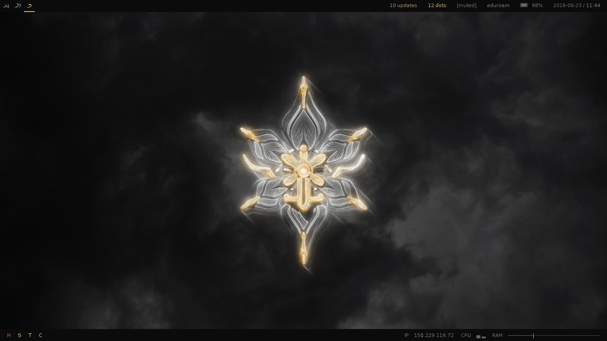
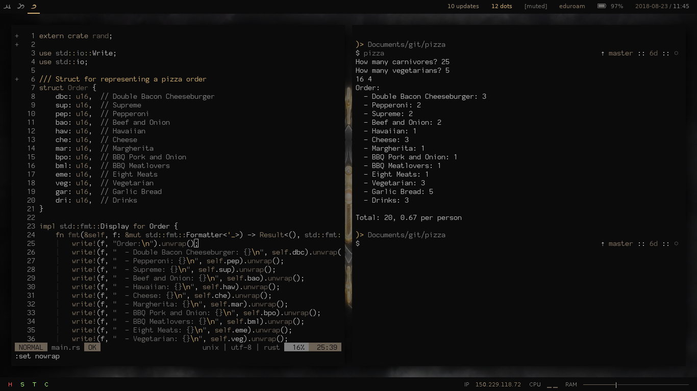
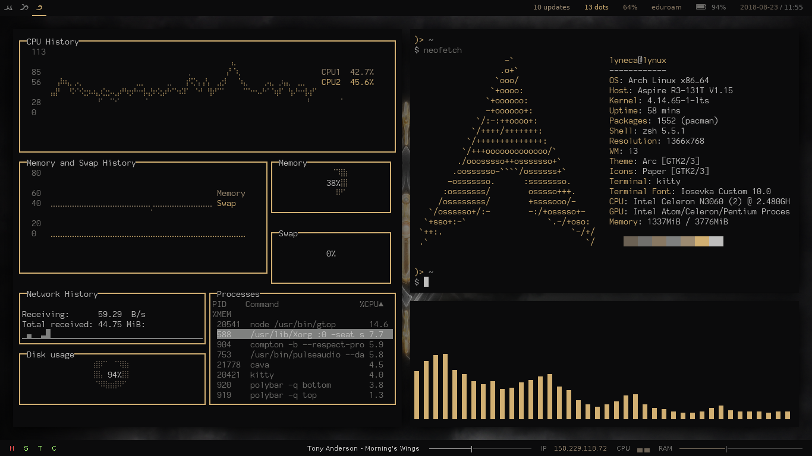
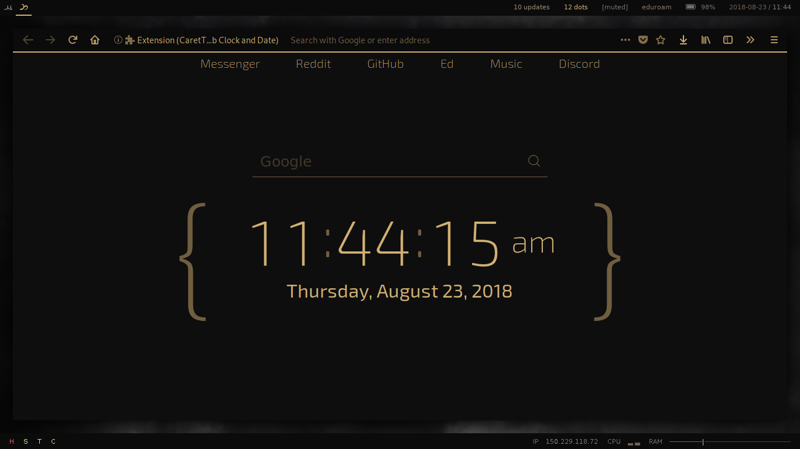
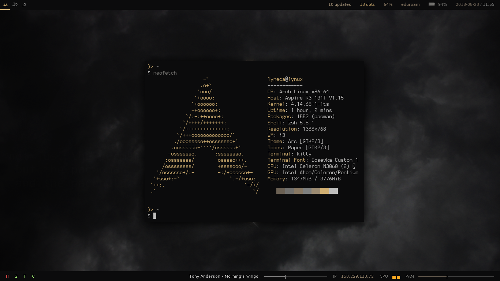
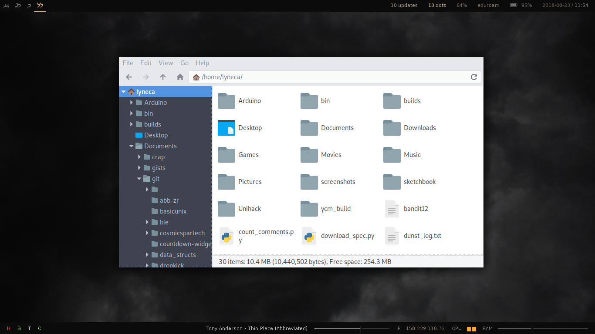

# My Dotfiles

Wal is god. All hail.

## Setup
	git init --bare $HOME/.cfg
	alias config='/usr/bin/git --git-dir=$HOME/.cfg/ --work-tree=$HOME'
	config config --local status.showUntrackedFiles no
	echo "alias config='/usr/bin/git --git-dir=$HOME/.cfg/ --work-tree=$HOME'" >> $HOME/.profile
    config remote add origin https://github.com/lyneca/dotfiles
	config pull origin master

And then get busy fixing all the inevitable errors...

## Used Packages
- [`i3-gaps`](https://github.com/Airblader/i3) - Tiling window manager
- [`zsh`](https://zsh.org) - Terminal shell
- [`antigen`]() - Terminal shell manager
- [`pywal`](https://github.com/dylanaraps/pywal) - Colorscheme generator
- [`polybar`](https://github.com/jaagr/polybar) - Status bars
- [`conky`](https://github.com/brndnmtthws/conky) - Rainmeter
- [`dmenu`](https://tools.suckless.org/dmenu/) - Launcher
- [`geometry`](https://github.com/lyneca/geometry) - ZSH theme (fork)
- [`dunst`](https://github.com/dunst-project/dunst) - Notifications
- [`wal.vim`](https://github.com/lyneca/wal.vim) - Vim theme (fork)

## Screenshots

## Credits
- Polybar theme based off [jaagr's Space theme](https://github.com/jaagr/dots/tree/master/.local/etc/themer/themes/space)
- Firewatch wallpaper by /u/Ryan3395 ([source](https://redd.it/6dvpxc)), based off a wallpaper from the excellent game [Firewatch](http://www.firewatchgame.com/)
- All images/media belong to their respective owners
