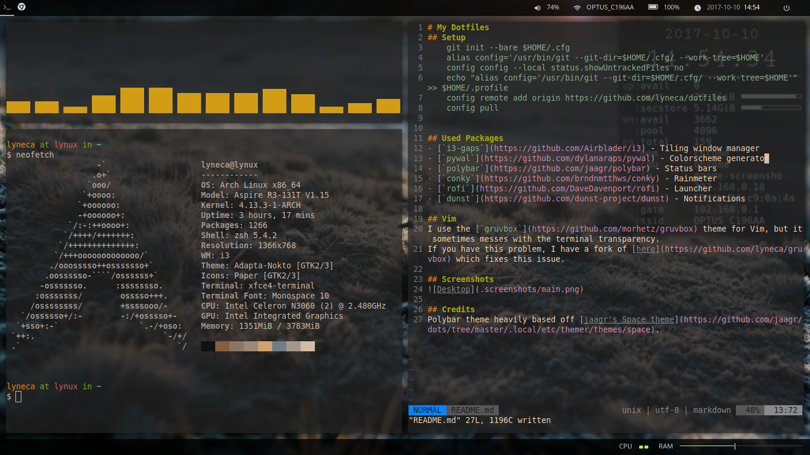
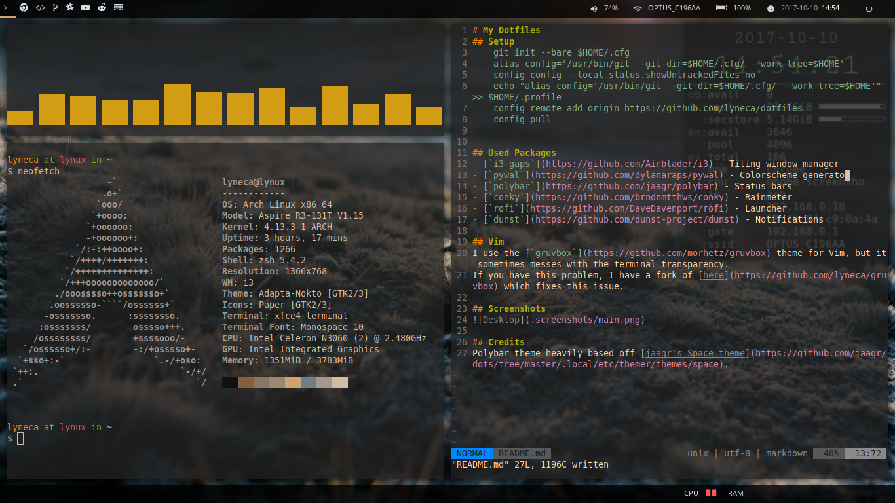
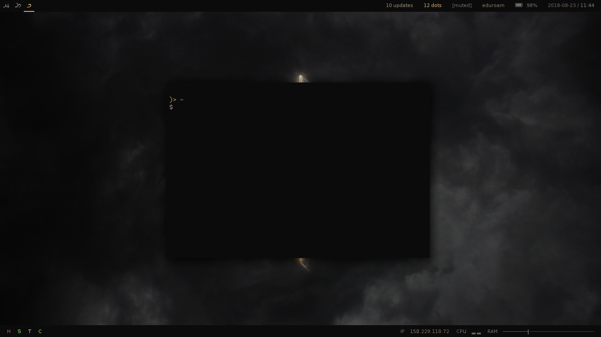
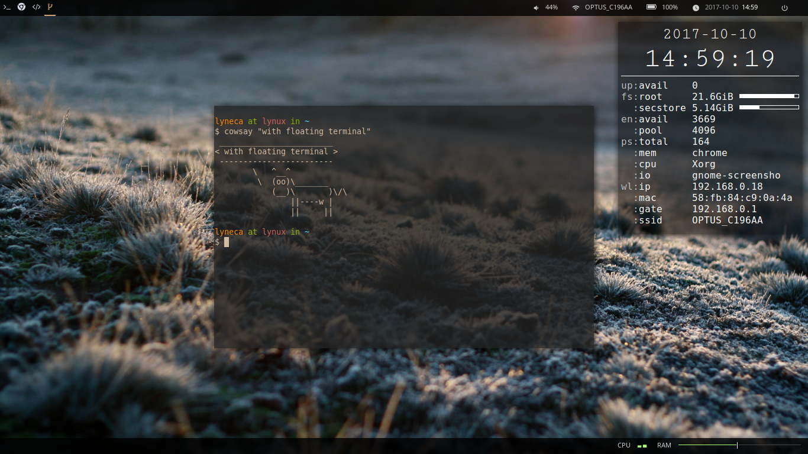

# My Dotfiles
## Setup
	git init --bare $HOME/.cfg
	alias config='/usr/bin/git --git-dir=$HOME/.cfg/ --work-tree=$HOME'
	config config --local status.showUntrackedFiles no
	echo "alias config='/usr/bin/git --git-dir=$HOME/.cfg/ --work-tree=$HOME'" >> $HOME/.profile
    config remote add origin https://github.com/lyneca/dotfiles
	config pull origin master

## Used Packages
- [`i3-gaps`](https://github.com/Airblader/i3) - Tiling window manager
- [`zsh`](https://zsh.org) - Terminal shell
- [`oh-my-zsh`](https://ohmyz.sh) - Terminal shell manager
- [`pywal`](https://github.com/dylanaraps/pywal) - Colorscheme generator
- [`polybar`](https://github.com/jaagr/polybar) - Status bars
- [`conky`](https://github.com/brndnmtthws/conky) - Rainmeter
- [`dmenu`](https://tools.suckless.org/dmenu/) - Launcher
- [`geometry`](https://github.com/geometry-zsh/geometry) - ZSH theme
- [`dunst`](https://github.com/dunst-project/dunst) - Notifications
- [`gruvbox`](https://github.com/morhetz/gruvbox) - Vim theme

## Vim

## Screenshots

## Credits
- Polybar theme heavily based off [jaagr's Space theme](https://github.com/jaagr/dots/tree/master/.local/etc/themer/themes/space).
- All images/media belong to their respective owners
