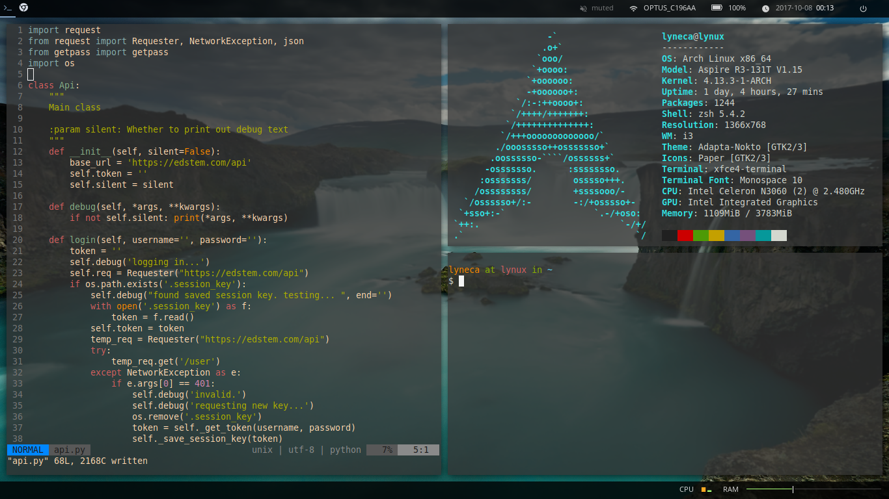

# My Dotfiles
## Setup
	git init --bare $HOME/.cfg
	alias config='/usr/bin/git --git-dir=$HOME/.cfg/ --work-tree=$HOME'
	config config --local status.showUntrackedFiles no
	echo "alias config='/usr/bin/git --git-dir=$HOME/.cfg/ --work-tree=$HOME'" >> $HOME/.profile
    config remote add origin https://github.com/lyneca/dotfiles
	config pull

## Used Packages
- [`i3-gaps`](https://github.com/Airblader/i3) - Tiling window manager
- [`polybar`](https://github.com/jaagr/polybar) - Status bars
- [`conky`](https://github.com/brndnmtthws/conky) - Rainmeter
- [`rofi`](https://github.com/DaveDavenport/rofi) - Launcher
- [`dunst`](https://github.com/dunst-project/dunst) - Notifications

## Vim
I use the [`gruvbox`](https://github.com/morhetz/gruvbox) theme for Vim, but it sometimes messes with the terminal transparency.
If you have this problem, I have a fork of [here](https://github.com/lyneca/gruvbox) which fixes this issue.

## Screenshots

